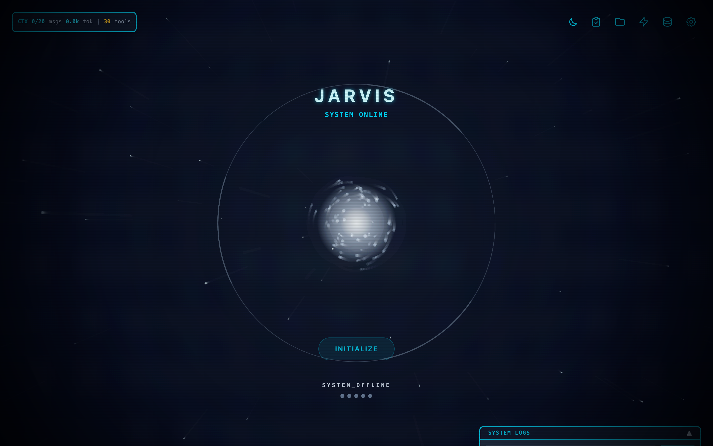

# JIT LoRA: Real-Time Continuous Model Learning During Conversation

<p align="center">
  
</p>

A language model that **rewrites its own weights while you talk to it** — and remembers what it learned.

This is real-time continuous learning: the model absorbs new knowledge from each conversation turn through live gradient-based LoRA adaptation, then immediately uses that knowledge in subsequent responses. No retraining pipeline. No RAG retrieval. The weights themselves change.

**Paper:** [paper.pdf](paper.pdf) | **License:** MIT

---

## The Innovation

Traditional LLMs are frozen after training. They cannot learn new facts without expensive fine-tuning pipelines that run offline, on separate infrastructure, disconnected from the conversation.

**JIT LoRA eliminates this barrier.** The model runs a background training cycle after every response — real backpropagation through LoRA adapters using `nn.value_and_grad()` — and the next query uses the updated weights immediately. Knowledge injection happens *during* the conversation, not before it.

The core challenge is **catastrophic forgetting**: naive weight updates destroy existing knowledge. A **≥33% regularization ratio** — mixing general-knowledge Q&A pairs into every training batch — eliminates this entirely: **100% knowledge preservation** across all experiments.

The model gets smarter as you talk to it, without losing what it already knows.

---

## Results

Controlled experiments with confidence intervals across three scales.

### Experiment 3: Real-World Facts (35 facts, 3 independent trials)

Facts the model **verifiably did not know** (confirmed via pre-test against base model), sourced from 2025-2026 events post-dating the training cutoff.

| Metric | Pooled | Per-Trial | 95% Wilson CI |
|---|---|---|---|
| **Recall** | 61/105 (58.1%) | 65.7%, 54.3%, 54.3% | **[48.5%, 67.1%]** |
| **Knowledge Preservation** | 60/60 (100.0%) | 100%, 100%, 100% | **[94.0%, 100.0%]** |

### Per-Category Recall

| Category | Score | 95% CI |
|---|---|---|
| Science | 3/3 (100%) | [43.8%, 100.0%] |
| Sports | 16/18 (88.9%) | [67.2%, 96.9%] |
| Awards | 18/21 (85.7%) | [65.4%, 95.0%] |
| Weather/Natural Events | 12/15 (80.0%) | [54.8%, 93.0%] |
| Technology/Business | 2/3 (66.7%) | [20.8%, 93.9%] |
| Entertainment | 4/12 (33.3%) | [13.8%, 60.9%] |
| Deaths/Obituaries | 6/33 (18.2%) | [8.6%, 34.4%] |
| **Excl. Deaths** | **55/72 (76.4%)** | **[65.4%, 84.8%]** |

Deaths fail systematically: the model learns the category ("person X died") but confabulates dates, because all death facts share identical structure. Categories with distinctive patterns achieve 76-100%.

### Experiment 2: Cross-Domain Reasoning (41 fictional facts, 10 interlocked domains)

| Category | Score | Notes |
|---|---|---|
| Direct Recall | **11/16 (69%)** | Core facts absorbed |
| Generalization | **9/16 (56%)** | Rephrased questions work |
| Cross-Domain Multi-Hop | **4/8 (50%)** | Multi-hop reasoning chains |
| Negation/Boundary | **5/5 (100%)** | Correctly denies false premises |
| Knowledge Preservation | **10/10 (100%)** | Zero catastrophic forgetting |

### Experiment 1: Controlled Validation (4 fictional facts)

| Metric | Baseline | Post-Training |
|---|---|---|
| Direct Recall | 0/4 | **4/4 (100%)** |
| Generalization | 0/4 | **4/4 (100%)** |
| Knowledge Preservation | 3/3 | **3/3 (100%)** |

---

## Why This Works: Key Findings

### 1. Learning Rate 10x Higher Than Standard LoRA

Standard LoRA fine-tuning uses LR = 1e-4 to 5e-5 over thousands of steps. JIT learning needs convergence in **single-digit epochs**. We use **5e-4** with gradient clipping (norm 1.0) for stability. This is the single most important hyperparameter choice.

### 2. The 33% Regularization Threshold

Below 33% regularization, catastrophic forgetting destroys existing knowledge ("What is the capital of France?" → "Vostane"). At ≥33%, knowledge preservation is 100% across all experiments. This is an experience replay approach — every training batch mixes novel facts with general-knowledge Q&A pairs.

### 3. Batching Doesn't Help

On unified memory architectures, forward/backward passes are **memory-bandwidth-limited**, not compute-limited. Batch=8 takes 2.5s/step vs 0.42s for batch=1 — nearly identical total time, but per-example learning is less effective. The only path to faster training is **fewer steps** through faster convergence.

### 4. Compilation Overhead Exceeds Benefit

`mx.compile()` has ~20s first-trace overhead. With only 48-220 total steps, this cost is never amortized. Raw execution at ~390ms/step is faster end-to-end.

---

## Architecture

```
User Input → Frontend → API Proxy → Neural Daemon (FastAPI)
                                          ↓
                                MLX Inference + Live LoRA Adapter
                                          ↓
                                Token Stream → Response
                                          ↓
                           [Background] LoRA Backprop (Adam + Cosine LR)
                                          ↓
                                Adapter Weights Updated
                                          ↓
                              Next query uses new knowledge
```

The daemon serializes inference and training through a GPU lock. After each response, the auto-train system runs a background training cycle. The next query uses the updated adapter — no reload, no restart.

### LoRA Configuration

| Parameter | Value | Rationale |
|---|---|---|
| Rank | 32 | Capacity for ~35 facts per session |
| Alpha | 32 | Scale = α/r = 1.0 |
| Targets | q, v, out, down_proj | Attention + MLP coverage across all layers |
| Trainable params | 10.3M | 0.54% of base model |
| Optimizer | Adam | β₁=0.9, β₂=0.999 |
| LR Schedule | Cosine → 5e-5 | Prevents late-epoch overshoot |
| Early stopping | Loss < 0.8 for 2 epochs | Convergence detection |

### Hybrid Architecture Support

Qwen3.5 models use Gated Delta Networks (GDN) with Metal-accelerated kernels that lack autograd support. The system routes through pure-MLX ops during training (`model.train()`) and fast Metal kernels during inference (`model.eval()`), with mode switching hoisted to cycle boundaries.

---

## Project Structure

```
├── src/                          # Source code
│   ├── mlx_lora_trainer.py       # Core training engine — LoRALinear, autograd, early stopping
│   ├── neural_daemon.py          # FastAPI daemon — inference, training orchestration, SSE
│   ├── neural_config.py          # Hyperparameter configuration
│   ├── neural_data.py            # Training data manager — rolling + replay buffers
│   ├── ane_bridge_py.py          # Python ctypes wrapper for ANE bridge
│   ├── ane_lora_trainer.py       # ANE training engine (requires ANE bridge)
│   ├── ane_mil_lora.py           # ANE kernel generators for LoRA forward/backward
│   ├── export_to_lms.py          # GGUF export for LM Studio
│   └── bridge/                   # ANE C bridge (from github.com/maderix/ANE, MIT)
│       ├── ane_bridge.h          # C API header
│       ├── ane_bridge.m          # Objective-C implementation
│       └── Makefile              # Build: `make` → libane_bridge.dylib
├── tests/
│   ├── test_daemon_e2e.py        # Experiment 1 — 4 fictional facts
│   ├── test_deep_e2e.py          # Experiment 2 — 41 facts, 10 domains, 70 test cases
│   ├── test_statistical_e2e.py   # Experiment 3 — real-world facts, 3 trials, CIs
│   ├── raw_facts_2026.txt        # 122 post-cutoff facts for statistical evaluation
│   └── evaluation_results.json   # Machine-readable results
├── figures/                      # Paper figures
├── paper.tex                     # Research paper (LaTeX)
└── paper.pdf                     # Compiled paper
```

## Running

### Requirements

Apple Silicon Mac (M-series). Models ≤2B parameters work on 16GB unified memory.

```bash
git clone https://github.com/eelbaz/jit-lora.git
cd jit-lora
pip install -r requirements.txt

# Build the ANE bridge (requires Xcode Command Line Tools)
cd src/bridge && make && cd ../..
```

The ANE bridge (`src/bridge/`) provides direct access to Apple Neural Engine hardware via private APIs. It is based on [maderix/ANE](https://github.com/maderix/ANE) (MIT License). Requires macOS 15+ on Apple Silicon.

### Quick Validation
```bash
python3 src/mlx_lora_trainer.py
# Downloads Qwen2.5-0.5B, runs 5 training steps, verifies loss decreases
```

### Full Experiments
```bash
# Terminal 1: Start daemon
python3 src/neural_daemon.py

# Terminal 2: Activate model + run experiments
curl -X POST http://localhost:8766/activate \
  -H "Content-Type: application/json" \
  -d '{"hf_repo":"Qwen/Qwen3.5-2B-Base"}'

python3 tests/test_daemon_e2e.py           # Experiment 1: controlled
python3 tests/test_deep_e2e.py             # Experiment 2: cross-domain
python3 tests/test_statistical_e2e.py      # Experiment 3: statistical
```

---

## Future Work

### Accuracy
- **Larger models (7B-9B)**: More adapter capacity to resolve structural pattern confusion (Deaths category)
- **Higher LoRA rank (64-128)**: More parameters for distinguishing structurally similar facts
- **Category-aware training**: Weighted loss and disambiguation tokens for homogeneous fact patterns
- **Curriculum learning**: Progressive difficulty — distinctive patterns first, then structurally similar facts
- **LoRA + RAG hybrid**: Weight updates for durable knowledge, retrieval for precise details

### Speed
- **ANE-GPU parallel inference**: LoRA forward passes on Neural Engine while base model runs on GPU
- **Sequence packing**: Multiple short examples packed into single sequences to reduce padding waste
- **QLoRA**: 4-bit quantized base model enables larger models with same memory
- **Per-fact early stopping**: Stop training individual facts that have converged

### Architecture
- **Swarm agent composition**: Multiple specialized LoRA adapters (facts, style, tools) composed at inference via weighted addition
- **Adapter persistence**: Save/load adapters across sessions for cumulative learning
- **Streaming training**: Train on each turn as it arrives rather than batching

---

## Citation

```bibtex
@article{elbaz2026jitlora,
  title={JIT LoRA: Real-Time Conversational Knowledge Injection on Apple Silicon via MLX},
  author={Elbaz, E.},
  year={2026},
  url={https://github.com/eelbaz/jit-lora}
}
```

## License

MIT License. See [LICENSE](LICENSE) for details.
